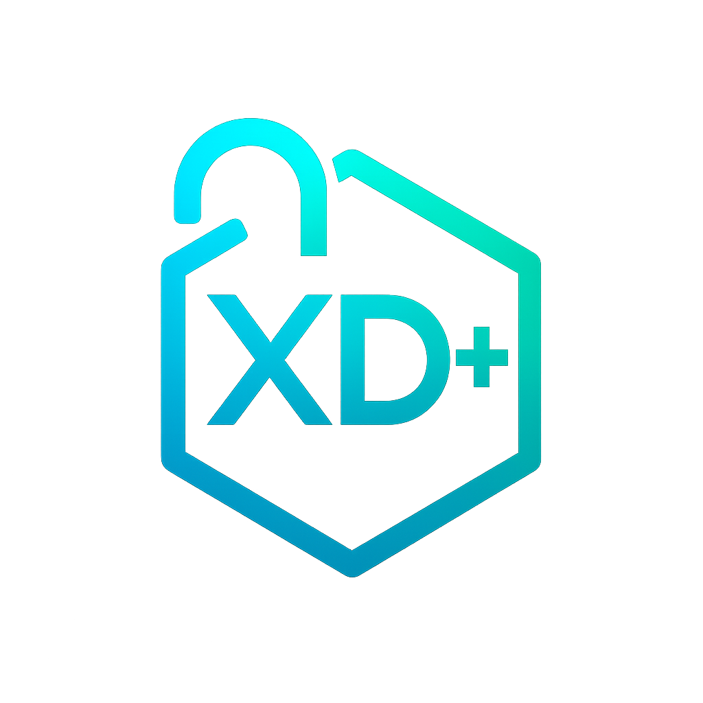
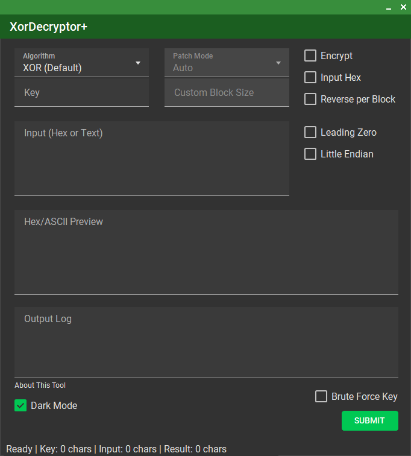
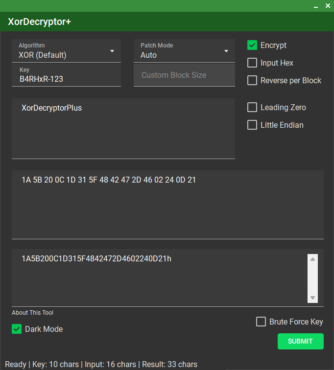
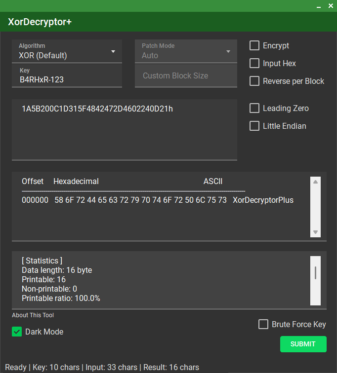

# XorDecryptor+

XorDecryptor+ is a simple application for encrypting and decrypting data using classic algorithms such as XOR, Vigenere Cipher, and Caesar Cipher. This program supports various key input formats (hex, array, ASCII) and is suitable for cryptography learning or basic data analysis.

<h3>Features</h3>
- Encryption & decryption with XOR, Vigenere, and Caesar Cipher 
- Patch mode and block size options 
- Brute force with random 1 or 2 bytes key (XOR only) 
- Light / Dark Mode 
- Using <a href=https://github.com/leocb/MaterialSkin>Material Skin</a> GUI 

## Quick look

 
Main Form 

 
Encryption Mode 

 
Decryption Mode 

## Usage
1. Select the desired algorithm.
2. Enter your data and key in the supported format.
3. Run the encryption or decryption process.

## Report issues
To report any bugs or issues with the injector, please create an [Issue](ISSUES) on Github

## Support
Support this by donating to my [Paypal](https://paypal.me/barhxr)

## License
This project is licensed under the MIT License. See the [LICENSE](LICENSE) file for details.
